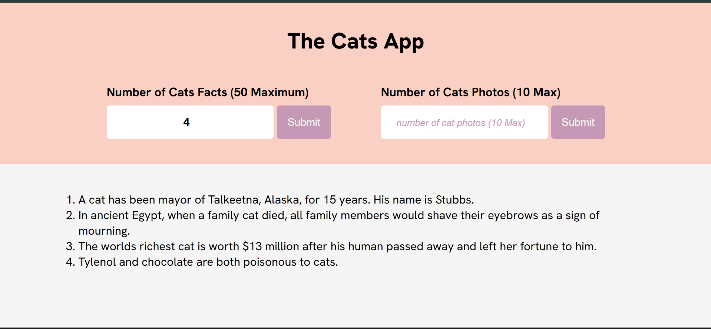

# The Cat App 🐾

A web application built with Vite that combines random cat facts and images from two APIs. Users can specify how many facts and pictures they want to see, making it purr-fect for cat enthusiasts!

----

## Features
- **Dual API Integration**: 
  - Fetch random cat facts from [MeowFacts API](https://meowfacts.herokuapp.com/)
  - Retrieve cat images from [The Cat API](https://api.thecatapi.com/)
- **Customizable Requests**:
  - Specify exact number of facts (1-10)
  - Request multiple cat images in one search
- **Responsive Design**: Works seamlessly across mobile and desktop
- **Modern Stack**: Built with Vite for fast development and optimized builds

## Installation
```bash
# Clone repository
git clone https://github.com/your-username/the-cat-app.git

# Install dependencies
npm install

# Start development server
npm run dev
```

## API Configuration
### 1. MeowFacts API
```javascript
// Example request for 3 facts
const response = await axios.get(
      `https://meowfacts.herokuapp.com/?count=${factCountValue}`
    );
    const data = response.data.data;
```

### 2. The Cat API
```javascript
// Example request for n images
const response = await axios.get(
      `https://api.thecatapi.com/v1/images/search?limit=${photoCountValue}`
    );
    const data = response.data;
```
## Deployment
1. Build production version:
   ```bash
   npm run build
   ```
2. Deploy folder to your preferred hosting service

## 💡 Tips for Customization
- Add social media sharing buttons


> **Note**: This is a basic website I cam up with in comparison to this one: https://the-cats-app-1.vercel.app/.